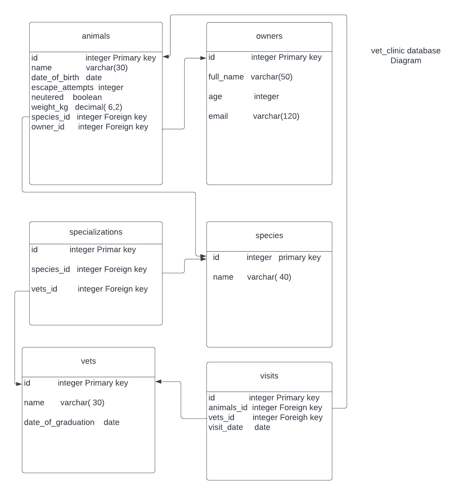

# Vet Clinic

## Getting Started

This repository includes files with plain SQL that can be used to recreate a database:

- Use [schema.sql](./schema.sql) to create all tables.
- Use [data.sql](./data.sql) to populate tables with sample data.
- Check [queries.sql](./queries.sql) for examples of queries that can be run on a newly created database. **Important note: this file might include queries that make changes in the database (e.g., remove records). Use them responsibly!**

<a name="readme-top"></a>

<div align="center">
   
    <br/>

  <h2><b>Schema Diagram </b></h2>

</div>

<!-- TABLE OF CONTENTS -->

# 📗 Table of Contents

- [📖 About the Project](#about-project)
  - [🛠 Built With](#built-with)
    - [Tech Stack](#tech-stack)
    - [Key Features](#key-features)
  - [🚀 Live Demo](#live-demo)
- [💻 Getting Started](#getting-started)
  - [Setup](#setup)
  - [Prerequisites](#prerequisites)
  - [Install](#install)
  - [Usage](#usage)
- [👥 Authors](#authors)
- [🔭 Future Features](#future-features)
- [🤝 Contributing](#contributing)
- [⭐️ Show your support](#support)
- [🙏 Acknowledgements](#acknowledgements)
- [❓ FAQ](#faq)
- [📝 License](#license)

<!-- PROJECT DESCRIPTION -->

# 📖 [Vet_clinic] <a name="about-project"></a>

> **[Vet_clinic]** :- is a relational database project to create the data structure for a vet clinic. I create a complete database with data about: animals, animals' owners, clinic employees and visits.

## 🛠 Built With <a name="built-with"></a>

### Tech Stack <a name="tech-stack"></a>

<details>
  <summary>Client</summary>
  <ul>
    <li>none</li>
  </ul>
</details>

<details>
  <summary>Server</summary>
  <ul>
    <li>none</li>
  </ul>
</details>

<details>
<summary>Database</summary>
  <ul>
    <li><a href="https://www.postgresql.org/">PostgreSQL</a></li>
  </ul>
</details>

<!-- Features -->

### Key Features <a name="key-features"></a>

- **[Display_List_of_animals]**
- **[Search_List_of_animals_by_properties]**

<p align="right">(<a href="#readme-top">back to top</a>)</p>

<!-- LIVE DEMO -->

## 🚀 Live Demo <a name="live-demo"></a>

> [Live_Demo_Link] ----> (coming soon)

<p align="right">(<a href="#readme-top">back to top</a>)</p>

<!-- GETTING STARTED -->

## 💻 Getting Started <a name="getting-started"></a>

> To get a local copy up and running, follow these steps.

### Prerequisites

In order to run this project you need:

- A Computer (MAC or PC)
- Code editor (VSCode,Atom etc...)
- A browser (Chrome,Mozilla,Safari etc...)
- Version Control System (Git and Github)
- NodeJS (https://nodejs.org/en/)
- React {https://react.dev/}
- PostgreSQL {https://www.postgresql.org/}

### Setup

Clone this repository to your desired folder:

```sh
  cd my-folder
  git clone git@github.com:Besufekad-HAZ/Vet_Clinic.git (SSH)
```

### Install

Install this project with:

- Install PostgreSQL [Win](https://www.postgresql.org/download/windows/)
- Install PostgreSQL [macOS](https://www.postgresql.org/download/macosx/)
- Install PostgreSQL [Linux](https://www.postgresql.org/download/linux/)

### Usage

To run a SQL file, execute the following command:

To use the \i command, you can type it followed by the path to the file containing the SQL commands you want to execute. For example:

`\i /path/to/file.sql `

This will execute the SQL commands in the specified file.

<!-- AUTHORS -->

## 👥 Authors <a name="authors"></a>

👤 **Besufekad Alemu**

- GitHub: [@Besufekad-HAZ](https://github.com/Besufekad-HAZ)
- Twitter: [@BesufekadAlemu7](https://twitter.com/BesufekadAlemu7)
- LinkedIn: [@besura](www.linkedin.com/in/besura)

<p align="right">(<a href="#readme-top">back to top</a>)</p>

<!-- FUTURE FEATURES -->

## 🔭 Future Features <a name="future-features"></a>

- [ ] **Medical records management**
- [ ] **Appointment scheduling**

<p align="right">(<a href="#readme-top">back to top</a>)</p>

<!-- CONTRIBUTING -->

## 🤝 Contributing <a name="contributing"></a>

Contributions, issues, and feature requests are welcome!

Feel free to check the [issues page](https://github.com/Besufekad-HAZ/Vet_Clinic/issues).

<p align="right">(<a href="#readme-top">back to top</a>)</p>

<!-- SUPPORT -->

## ⭐️ Show your support <a name="support"></a>

> If you like this project rate it and give it a star...

<p align="right">(<a href="#readme-top">back to top</a>)</p>

<!-- ACKNOWLEDGEMENTS -->

## 🙏 Acknowledgments <a name="acknowledgements"></a>

> I would like to thank the [Microverse team](https://www.microverse.org/) for allowing us to work on this Vet Clinic Database project.

<p align="right">(<a href="#readme-top">back to top</a>)</p>

<!-- FAQ (optional) -->

## ❓ FAQ <a name="faq"></a>

- **Do i need PostgreSQL installed?**

  - Yes...

- **Do i need internet Access?**

  - No, you don't the PostgreSQL database server can work offline. And If your server does not have internet access you can install PostgreSQL offline.

<p align="right">(<a href="#readme-top">back to top</a>)</p>

<!-- LICENSE -->

## 📝 License <a name="license"></a>

This project is [MIT](./LICENSE) licensed.

<p align="right">(<a href="#readme-top">back to top</a>)</p>
